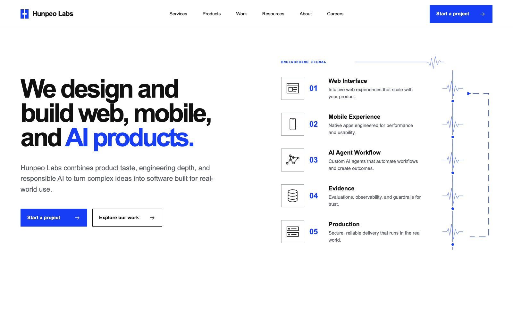

# Hunpeo Labs — Web, Mobile, and AI Engineering

[](https://github.com/phamhungptithcm/HunpeoLabs/releases)
[](https://nextjs.org/)
[](https://www.typescriptlang.org/)

The official source repository for the Hunpeo Labs marketing website. It is a
multi-page Next.js website for presenting digital product development, mobile
app development, AI agent engineering, platform modernization, engineering
governance, and the products being developed by Hunpeo Labs.



## What the website covers

### Engineering services

- **Web Development** — marketing websites, web applications, and SaaS
  experiences built around clarity, accessibility, and maintainable delivery.
- **Mobile App Development** — mobile products shaped around real workflows,
  dependable interaction, and release readiness.
- **AI Agent Development** — bounded agent workflows with explicit tools,
  evaluation, evidence, and human approval.
- **AI Product Engineering** — user-facing AI features designed around product
  behavior, failure states, and production constraints.
- **Platform Modernization** — phased modernization paths connecting
  architecture, migration risk, operational evidence, and rollback.
- **Architecture & Governance** — reviewable technical decisions with explicit
  ownership, risk, approval, and verification.

### Products and open engineering work

- [AI Agent Kit](https://github.com/phamhungptithcm/ai-agent-kit) — an
  open-source engineering platform for repository-aware AI agents with
  authorization and evidence boundaries.
- **IncOv** — operational incident intelligence under validation, built around
  reviewed knowledge, bounded assessment, and human approval.
- [Gig](https://github.com/phamhungptithcm/gig) — evidence-first release
  intelligence for tracing source changes through the delivery path.

The repository does not present unsupported customer outcomes, production
metrics, or case-study claims.

## Website architecture

The site provides separate routes for Services, Products, Work, Resources,
About, Careers, Contact, Privacy, and individual service and product profiles.
It includes:

- Responsive UI, accessible navigation, and reduced-motion support.
- Canonical, Open Graph, and Twitter metadata with fail-closed indexing.
- Source-backed Organization, WebSite, Service, Product,
  SoftwareSourceCode, and Breadcrumb structured data.
- Sitemap, `robots.txt`, RSS, and `/llms.txt` discovery foundations.
- Server-side contact validation, spam controls, and honest delivery states.
- Chromium, Firefox, and WebKit browser validation.

## Technology

- Next.js 16 and React 19
- TypeScript 6
- Vitest
- Playwright
- Lighthouse CI
- GitHub Actions
- Firebase App Hosting

## Requirements

- Node.js 24 or newer
- pnpm 11.9.0

## Local development

```bash
pnpm install --frozen-lockfile --ignore-scripts
pnpm dev
```

The site fails closed to `noindex` when a verified HTTPS production origin is
not configured.

## Quality gates

```bash
pnpm lint
pnpm typecheck
pnpm test
pnpm build
pnpm test:e2e:core
pnpm test:e2e:production
pnpm test:e2e:cross-browser
pnpm lighthouse:ci
```

## Release build

```bash
NEXT_PUBLIC_SITE_URL=https://hunpeolabs.com \
VERCEL_ENV=production \
pnpm release:build v0.2.0
```

The example origin is a CI fixture only. A production build requires the real,
verified HTTPS origin.

See the [v0.2.0 release notes](docs/releases/v0.2.0.md) for the current source
release and its verified scope.

## Production configuration

See [Production readiness](docs/operations/production-readiness.md) for contact
delivery, indexing, privacy, security, monitoring, preview, and rollback
requirements.

The production target is Firebase App Hosting backend `hunpeolabs` in Firebase
project `hunpeolabs-prod`. Before creating or rolling out the backend:

```bash
pnpm firebase:preflight
```

App Hosting requires the Firebase Blaze plan. Contact delivery remains disabled
until a reviewed provider and its secrets are configured through Firebase
Secret Manager. Creating a GitHub source release does not deploy the website.
