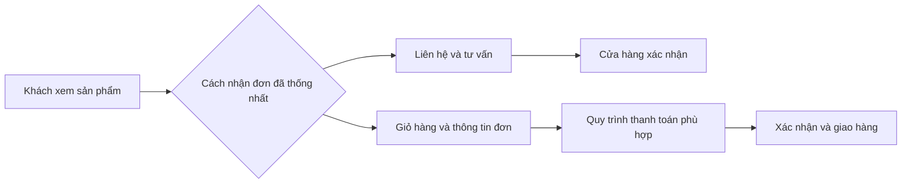

# Website catalogue và website bán hàng khác nhau thế nào?

Khi nói “tôi muốn làm website bán hàng”, có người đang nghĩ đến một nơi trưng bày sản phẩm để khách gọi hỏi. Có người lại muốn khách chọn hàng, nhập địa chỉ, thanh toán và theo dõi đơn ngay trên web.

Cả hai nhu cầu đều hợp lý. Nhưng nếu không nói rõ từ đầu, bạn và người làm website rất dễ hình dung hai sản phẩm khác nhau.

*Hai luồng minh họa. Tính năng thực tế phụ thuộc phạm vi đã thống nhất.*

## Catalogue giúp khách hiểu bạn đang bán gì

Website catalogue thường tập trung vào sản phẩm: hình ảnh, mô tả, nhóm hàng và thông tin cần thiết để khách hỏi thêm. Bước cuối có thể là gọi điện, gửi yêu cầu hoặc mở một kênh liên hệ đã xác nhận.

Cách này phù hợp khi giá cần tư vấn, việc giao lắp phụ thuộc từng trường hợp hoặc bạn muốn kiểm tra hàng trước khi nhận đơn. Người bán vẫn tham gia nhiều vào cuộc trò chuyện.

Một catalogue cũng có thể công khai giá nếu cửa hàng muốn và có khả năng giữ giá cập nhật. Không có giỏ hàng không có nghĩa là phải giấu giá; đây là hai quyết định riêng.

## E-commerce thêm một quy trình nhận đơn

Khi khách có thể đặt hàng trực tiếp, câu chuyện đi xa hơn trang sản phẩm. Giỏ hàng tính số lượng ra sao? Đơn được tạo lúc nào? Ai nhận thông báo? Cửa hàng xác nhận bằng cách nào?

Thanh toán online là một lựa chọn cần bàn riêng. Website nhận đơn vẫn có thể dùng hình thức thanh toán khác nếu quy trình phù hợp. Ngược lại, có một nút thanh toán chưa đủ để giải quyết giao nhận, hủy đơn và hỗ trợ khách.

Nếu có kết nối kho, phần mềm bán hàng hoặc đơn vị vận chuyển, cần làm rõ bên nào giữ dữ liệu chính và xử lý thế nào khi kết nối gặp lỗi. Với khách mua, điều quan trọng là biết đơn của họ đã được nhận hay chưa.

## Đừng chọn chỉ vì bên kia nhiều tính năng hơn

Hãy thử đi qua một đơn hàng hiện tại của cửa hàng. Khách hỏi gì? Nhân viên kiểm tra gì? Có bước nào phải gọi xác nhận? Khi giao không được thì xử lý ra sao?

Nếu bạn còn phải tư vấn trước mỗi đơn, catalogue có thể là điểm bắt đầu phù hợp. Nếu giá, lựa chọn sản phẩm và quy trình giao hàng đã rõ, website nhận đơn trực tiếp có thể giúp khách tự làm được nhiều bước hơn.

Đây không phải một cuộc đua. Bạn có thể bắt đầu với catalogue rồi bổ sung giỏ hàng sau. Tuy nhiên, nên nói trước về hướng đó để phần thiết kế và dữ liệu có thể được xem xét, thay vì mặc định mọi nâng cấp đều đơn giản.

## Một diagram để dễ hình dung

<!-- Diagram source for editors -->

Diagram này mô tả ý tưởng, không phải một quy trình được áp dụng cho mọi cửa hàng.

## Checklist: nên hỏi người làm website

- Website chỉ nhận yêu cầu hay tạo đơn hàng?
- Khách biết đơn được xác nhận bằng cách nào?
- Giá, phí giao hàng và tình trạng sản phẩm được cập nhật ở đâu?
- Thanh toán, vận chuyển và tồn kho có kết nối với bên nào không?
- Phí của các bên đó, vận hành và hỗ trợ thuộc trách nhiệm ai?

Bạn không cần thuộc hết thuật ngữ để bắt đầu. Chỉ cần mô tả một đơn hàng từ lúc khách hỏi đến khi nhận được hàng. Từ câu chuyện đó, cả hai bên sẽ dễ thống nhất website cần làm gì hơn.

[Trao đổi về website cửa hàng với HunpeoLabs](/contact?audience=local-shops). Giỏ hàng, đặt hàng, thanh toán, vận chuyển và tồn kho được thống nhất theo phạm vi dự án.
