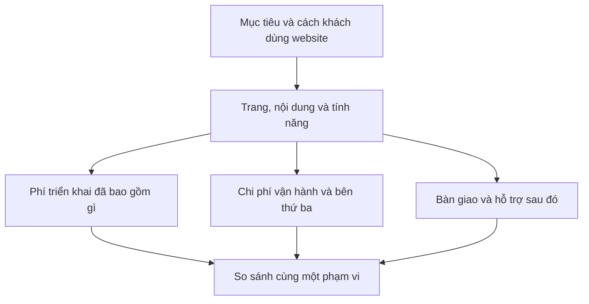

# Chi phí làm website gồm những khoản nào?

Khi hỏi giá làm website, bạn có thể nhận được những báo giá rất khác nhau. Một bên nói phí thiết kế và lập trình. Một bên kèm hosting năm đầu. Một bên báo theo gói, nhưng chưa rõ ai nhập sản phẩm và ai cập nhật sau này.

Muốn so sánh, nên bắt đầu bằng việc nhìn xem mỗi báo giá đang bao gồm những gì. Bài này không đưa một bảng giá chung, vì phạm vi và điều kiện của từng dự án khác nhau.

*Minh họa nhóm chi phí. Không phải báo giá hay cam kết dịch vụ của HunpeoLabs.*

## Phần làm ra website

Đây có thể gồm việc làm rõ nhu cầu, sắp xếp nội dung, thiết kế giao diện, lập trình, kiểm tra và bàn giao. Tuy nhiên, cần đọc phạm vi cụ thể thay vì mặc định tất cả đều có trong giá.

Bạn nên hỏi có bao nhiêu trang, loại trang nào, chỉnh sửa thiết kế được thống nhất ra sao và phần nội dung thuộc trách nhiệm ai. “Website có trang sản phẩm” vẫn chưa nói rõ việc nhập mười sản phẩm hay cả một danh mục lớn có được bao gồm không.

Với ảnh và bài viết, có dự án khách hàng cung cấp, có dự án cần thuê thực hiện riêng. Đây là phần dễ bị bỏ sót khi mọi người chỉ nói đến giao diện.

## Phần để website hoạt động

Tên miền, hosting và các dịch vụ cần thiết có thể phát sinh phí theo kỳ. Nếu dùng công cụ hoặc nền tảng bên ngoài, điều kiện và phí phụ thuộc nhà cung cấp.

Hãy hỏi ai đứng tên tài khoản, ai thanh toán và khi cần chuyển sang bên khác thì dữ liệu hoặc source code được bàn giao thế nào. Những chi tiết này giúp bạn hiểu mình sẽ quản lý website ra sao sau khi nhận.

Không nên hiểu “bàn giao source code” là mọi phần mềm hay dịch vụ bên thứ ba đều tự động thuộc sở hữu của bạn. Quyền sử dụng, dữ liệu, tài khoản và giấy phép cần được nói rõ.

## Phần thay đổi và hỗ trợ về sau

Bạn muốn thay ảnh, thêm sản phẩm hoặc sửa một mục trên trang? Ai làm và tính phí thế nào?

Bảo trì, hỗ trợ lỗi trong phạm vi và phát triển tính năng mới là những việc cần phân biệt trong thỏa thuận. Một yêu cầu thêm giỏ hàng sau bàn giao không giống việc sửa một nút bị lỗi trong chức năng đã thống nhất.

Với website bán hàng, thanh toán, vận chuyển, đồng bộ tồn kho và thông báo đơn có thể làm phạm vi thay đổi đáng kể. Hãy mô tả quy trình mong muốn rồi hỏi phần nào được bao gồm, phần nào cần báo giá riêng.

## Cách so sánh hai báo giá

<!-- Diagram source for editors -->

Diagram này là một cách đọc báo giá, không phải công thức tính tiền.

## Checklist: trước khi đồng ý

- Đã ghi rõ trang, tính năng và nội dung cần bàn giao chưa?
- Phí triển khai và các khoản theo kỳ đã tách rõ chưa?
- Các phí bên thứ ba do ai trả, và điều kiện có thể thay đổi không?
- Ai quản lý tên miền, hosting, source code và tài khoản?
- Hỗ trợ sau bàn giao gồm việc gì, trong điều kiện nào?
- Khi cần đổi phạm vi, hai bên xác nhận thế nào?

Bạn không nhất thiết phải chọn báo giá có nhiều tính năng nhất. Một phạm vi vừa với nhu cầu, có trách nhiệm rõ và đủ khả năng vận hành thường dễ đánh giá hơn một lời hứa “trọn gói” chưa được giải thích.

[Chuẩn bị brief cùng HunpeoLabs](/contact?audience=local-shops). Hãy chia sẻ loại website, tính năng cần thiết và ngân sách dự kiến; giá và điều kiện sẽ được xác nhận theo phạm vi.
