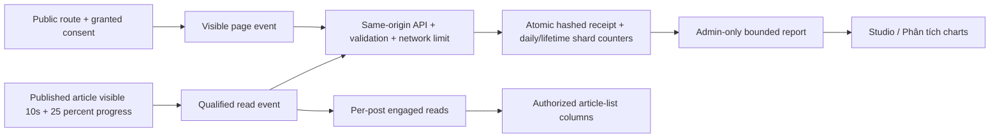

# Studio traffic

Enable `NEXT_PUBLIC_TRAFFIC_ENABLED=true` in a reviewed build. Uses the existing BLOG_ENABLED, Firebase project and rate-limit secret; global mode does not require an IP header; never enable production emulator fallback. Roll out Firestore TTL on `trafficReceipts.expiresAt` and `blogViewSessions.expiresAt` separately with deployment approval. Rules remain deny-all for clients; writes are server-only.

First-party collection honors analytics consent. A 30-minute idle anonymous tab session is a visit; page views count visible route entries/reloads, with replay-safe event IDs. Article opens in new analytics are distinct from legacy `blogPostStats.views` (deduplicated per article/session for 24h). Engaged reads require 10s visible article exposure and 25% progress; once per article/session/24h. These measure eligible activity, not unique people or comprehension. No historical site traffic/read backfill is possible. Separate devices/tabs, declined consent, offline, storage blocking and undetected bots affect coverage.

Admin only can access `/api/traffic?days=1|7|30`. UTC daily buckets, eight counter shards, maximum 248 shard reads (including eight lifetime shards) per 30-day report, batch post-stat reads per loaded Studio page, no per-row realtime listener. Global mode limits the site to 1200 events/10min and each hashed session to 120 events/10min; receipt TTL is 24h and transactions inspect expiry without relying on TTL deletion timing. Per accepted event typically reads six documents (eight for article events) and writes three to six; rate limiter adds its own operations. Costs depend on traffic and report refreshes; no hard dollar ceiling. Retries are bounded; no persistent offline event queue. Staff and recognizable bots are excluded by the API. IDs/IP are HMAC-hashed before receipts/limits; no raw IP/referrer/query/body archives.

When uninitialized or unavailable, Studio shows —, not invented zeros. Existing author access scope controls the batch list of post IDs; only admins see site totals. Existing legacy views retain their existing collection behavior independently from optional first-party traffic.

Roll back collection using flag=false in a reviewed build; leave counters intact. For operational failures, inspect existing structured blog error codes (INGRESS_NOT_CONFIGURED, TRAFFIC_DISABLED, COUNTER_LIMIT); do not log event payloads. Build, emulator concurrency and browser consent validation are required before production promotion.

Charts use React-owned SVG (four small trends plus one comparison), at most 30 UTC days, zero-based shared count scale, and straight segments through measured values. Pre-collection dates are omitted. Single-day filters show markers instead of an invented trend. Day selection and a semantic data table support keyboard, touch and screen readers; no animation or chart dependency added. Visual fixtures are synthetic emulator data only.

Studio analytics lives at `/admin/blog/analytics` (Phân tích), visible and authorized only for administrators. The article dashboard retains per-article view/read columns without the site-wide chart panel.

## Tracking audit and release gate

All current concrete public pages and published product/service catalog routes are covered by a source-backed route inventory test. `/blog-account` redirects into the measured public blog; admin, login, preview, API and assets stay excluded. Query/hash changes do not create a new page view. A published article owns a stable collector independent of the optional legacy views display.

A timed-out attempt retries once with the same nonce; it does not cancel future reading events. Qualified reads arriving before page events also establish the visit, preventing ordering-related undercount. Corrupt or overflowed counters fail closed instead of becoming false zeroes. Dashboard configuration states distinguish disabled/blocked collection from configured prerequisites; configured is not proof of ingress trust or live recording.

The release config enables first-party tracking with global budgets. Verify BUILD/RUNTIME flags, mounted secret, TTL, live visitor POST/read increments and authorized chart readback before claiming production acceptance. Do not infer production capture from synthetic emulator charts. Legacy blog views are distinct from optional consent-based engaged reads.

### Verified local evidence

The deep audit checks the real collector lifecycle (visible/hidden time, progress threshold, timeout replay, consent denial, blocked storage, excluded routes, cleanup and cross-tab consent filtering), not only aggregation mocks. The dedicated demo browser flow produced lifetime deltas of visits +1, pageViews +2, blogOpens +1, reads +1; per-post views/reads became 1/1. Denying consent before navigating to About produced no new event. The admin chart read back the same new blog-open/read increments. These are local emulator observations, not production evidence.

## Production release configuration
App Hosting enables NEXT_PUBLIC_TRAFFIC_ENABLED at build/runtime and TRAFFIC_RATE_LIMIT_MODE=global at runtime. Existing secret reference and One Tap remain unchanged. In global mode, all traffic consumes a shared 1200-events/10-minute budget plus a hashed per-session 120-events/10-minute budget. No forwarding IP header is trusted. Rejected requests do not increment analytics counters; abuse or spikes can undercount. This is a collection cap, not a hard dollar billing cap; denied requests still use compute/rate-limit reads. Traffic receipt and legacy blog-view-session expiresAt TTLs are enabled without deleting content.
